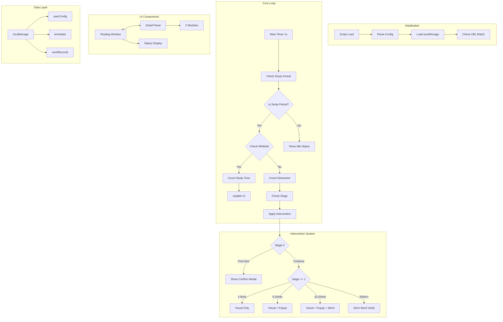
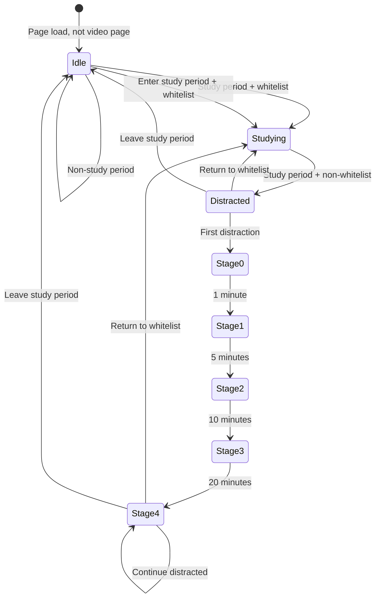

# Design Document: B站学习专注提醒助手 (BiliBili Study Focus Reminder Assistant)

## 1. Overview

This document specifies the technical design for a Tampermonkey script that provides progressive, non-intrusive focus interventions during user-defined study periods on Bilibili video pages.

The system monitors user activity, tracks study vs distraction time, and provides escalating interventions (visual changes, popups, word verification quizzes) when the user is watching non-study content during designated study periods.

### 1.1 Design Goals

- **Non-intrusiveness**: Interventions escalate gradually, giving users multiple chances to refocus
- **Persistence**: All settings and statistics persist across browser sessions via localStorage
- **Visual feedback**: Clear status indicators via floating window and detail panel
- **Learning integration**: Word verification quizzes help users learn vocabulary during interventions

### 1.2 Browser Compatibility

- **Chrome**: Full support (tested on Chrome 90+)
- **Edge**: Full support (Chromium-based Edge 90+)
- **Firefox**: Not supported (Tampermonkey API differences)
- **Other browsers**: Not tested

---

## 2. Architecture

### 2.1 System Architecture Diagram



### 2.2 Module Structure

```
┌─────────────────────────────────────────────────────────────┐
│                    Tampermonkey Script                       │
├─────────────────────────────────────────────────────────────┤
│  ┌─────────────┐  ┌─────────────┐  ┌─────────────────────┐  │
│  │  Config     │  │  State      │  │  localStorage       │  │
│  │  Module     │  │  Machine    │  │  Manager            │  │
│  └─────────────┘  └─────────────┘  └─────────────────────┘  │
├─────────────────────────────────────────────────────────────┤
│  ┌─────────────┐  ┌─────────────┐  ┌─────────────────────┐  │
│  │  Page       │  │  Floating   │  │  Detail Panel       │  │
│  │  Monitor    │  │  Window     │  │  (Modal)            │  │
│  └─────────────┘  └─────────────┘  └─────────────────────┘  │
├─────────────────────────────────────────────────────────────┤
│  ┌─────────────┐  ┌─────────────┐  ┌─────────────────────┐  │
│  │  Intervention│ │  Word       │  │  Statistics         │  │
│  │  Controller │  │  Verifier   │  │  Tracker            │  │
│  └─────────────┘  └─────────────┘  └─────────────────────┘  │
├─────────────────────────────────────────────────────────────┤
│  ┌─────────────────────────────────────────────────────────┐│
│  │  CSS Injection (GM_addStyle)                            ││
│  └─────────────────────────────────────────────────────────┘│
└─────────────────────────────────────────────────────────────┘
```

### 2.3 Key Design Decisions

1. **SPA Monitoring**: Use MutationObserver to detect Bilibili's SPA route changes
2. **Timer-based polling**: Main loop runs every 1 second for status checks
3. **State machine**: Intervention stages transition based on distraction duration
4. **Modular CSS**: All styles injected via GM_addStyle for clean separation

---

## 3. Data Models

### 3.1 localStorage Structure

```javascript
// Key: "bilibiliStudyAssistant_config"
// Module: userConfig
{
    "version": "1.0.0",
    "studyPeriods": [          // Array of [start, end] pairs in "HH:MM"
        ["08:00", "12:00"],
        ["14:00", "18:00"],
        ["19:00", "22:00"]
    ],
    "whitelist": [             // Array of BV numbers
        "BV1xx411c7mD",
        "BV1xx411c7XX"
    ],
    "interventionConfig": {
        "stages": [
            { "threshold": 0,    "interval": 0 },      // Stage 0: Confirm modal
            { "threshold": 60,   "interval": 0 },      // Stage 1: 1 min, visual only
            { "threshold": 300,  "interval": 120 },    // Stage 2: 5 min, popup 2min
            { "threshold": 600,  "interval": 30 },     // Stage 3: 10 min, popup 30s
            { "threshold": 1200, "interval": 15 }      // Stage 4: 20 min, popup 15s
        ]
    },
    "vocabulary": [            // Array of "Chinese:English" strings
        "学习:study",
        "专注:focus",
        "进步:progress"
    ],
    "masteryThreshold": 3,     // Consecutive correct answers to master
    "includeMasteredWords": false,
    "floatingWindow": {
        "enabled": true,
        "position": { "x": 20, "y": 100 },
        "showStats": true
    },
    "statsPeriod": "day"       // "day" or "week"
}

// Key: "bilibiliStudyAssistant_stats"
// Module: timeStats
{
    "lastResetDate": "2024-01-15",
    "today": {
        "studyTime": 3600,        // seconds
        "distractionTime": 1200,  // seconds
        "distractionCount": 3,
        "wordAccuracy": { "correct": 15, "total": 20 }
    },
    "history": [
        { "date": "2024-01-14", "studyTime": 7200, "distractionTime": 600, ... },
        // ... up to 30 days
    ]
}

// Key: "bilibiliStudyAssistant_words"
// Module: wordRecords
{
    "words": {
        "学习": {
            "chinese": "学习",
            "english": "study",
            "consecutiveCorrect": 3,
            "mastered": true,
            "totalAttempts": 10,
            "correctAttempts": 8
        }
    },
    "recentAnswers": [
        { "word": "学习", "correct": true, "timestamp": 1705312800000 },
        // ... last 50 answers
    ]
}
```

### 3.2 Runtime State

```javascript
// In-memory state (not persisted)
const appState = {
    isActive: false,           // Script initialized on matching URL
    isStudyPeriod: false,      // Current time within study periods
    isWhitelisted: false,      // Current video in whitelist
    currentBV: null,           // Current video BV number
    distractionStartTime: null,// When distraction began
    currentStage: 0,           // Current intervention stage (0-4)
    lastPopupTime: 0,          // Last popup shown timestamp
    isFullscreen: false,       // Video fullscreen state
    isDragging: false,         // Floating window drag state
    dragStartPos: null,        // Drag start position
    panelOpen: false           // Detail panel open state
};
```

---

## 4. Components and Interfaces

### 4.1 Configuration System

**Module**: `ConfigManager`

```javascript
// Public API
const ConfigManager = {
    // Load config from localStorage or return defaults
    load(): UserConfig,

    // Save config to localStorage
    save(config: UserConfig): void,

    // Get current config (merged with defaults)
    get(): UserConfig,

    // Check if current time is within study period
    isStudyTime(): boolean,

    // Check if BV is whitelisted
    isWhitelisted(bv: string): boolean,

    // Get intervention config for stage
    getInterventionConfig(stage: number): InterventionStage
};
```

**Configuration Parameters** (User-editable at script top):

```javascript
// ==========================================
// USER CONFIGURATION - Edit these values
// ==========================================
const USER_CONFIG = {
    // Study time periods: [["HH:MM", "HH:MM"], ...]
    studyPeriods: [
        ["08:00", "12:00"],
        ["14:00", "18:00"],
        ["19:00", "22:00"]
    ],

    // Whitelist: ["BV1xx411c7mD", ...]
    whitelist: [],

    // Intervention thresholds (seconds) and popup intervals (seconds)
    interventionStages: [
        { threshold: 0,   interval: 0 },    // Stage 0: Confirm
        { threshold: 60,  interval: 0 },    // Stage 1: 1min, visual
        { threshold: 300, interval: 120 },  // Stage 2: 5min, popup 2min
        { threshold: 600, interval: 30 },   // Stage 3: 10min, popup 30s
        { threshold: 1200, interval: 15 }   // Stage 4: 20min, popup 15s
    ],

    // Vocabulary: ["Chinese:English", ...]
    vocabulary: [
        "学习:study",
        "专注:focus",
        "进步:progress",
        "努力:effort",
        "坚持:persistence"
    ],

    // Consecutive correct answers to master a word
    masteryThreshold: 3,

    // Include mastered words in verification
    includeMasteredWords: false,

    // Floating window settings
    floatingWindow: {
        enabled: true,
        defaultPosition: { x: 20, y: 100 },
        showStats: true
    },

    // Statistics period
    statsPeriod: "day"  // "day" or "week"
};
```

### 4.2 Page Activation and SPA Monitoring

**Module**: `PageMonitor`

```javascript
const PageMonitor = {
    // Initialize page monitoring
    init(): void,

    // Check if current URL matches Bilibili video pages
    isVideoPage(): boolean,

    // Extract BV from current URL
    getCurrentBV(): string | null,

    // Set up MutationObserver for SPA navigation
    observeSPAChanges(callback: Function): void,

    // Check if page is visible (not background tab)
    isPageActive(): boolean,

    // Check fullscreen state
    isFullscreen(): boolean
};
```

**URL Matching Pattern**: `*://www.bilibili.com/video/BV*`

**SPA Monitoring Strategy**:
- Use `MutationObserver` on `#bilibiliRoot` or `body`
- Listen for `pushState` and `replaceState` events
- Re-check URL after navigation completes

### 4.3 Floating Window

**Module**: `FloatingWindow`

```javascript
const FloatingWindow = {
    // Create and render floating window
    create(): HTMLElement,

    // Update status display
    updateStatus(status: {
        isStudying: boolean,
        stage: number,
        timeDisplay: string
    }): void,

    // Show/hide based on fullscreen
    setFullscreen(isFullscreen: boolean): void,

    // Get/set position
    getPosition(): { x: number, y: number },
    setPosition(x: number, y: number): void,

    // Handle drag start/move/end
    onDragStart(e: MouseEvent): void,
    onDragMove(e: MouseEvent): void,
    onDragEnd(e: MouseEvent): void
};
```

**Visual States**:

| State | Background Color | Text | Time Display |
|-------|-----------------|------|--------------|
| Studying | `rgba(34, 139, 34, 0.7)` | "学习中" | "今日学习：XhXm" |
| Distracted Stage 0 | `rgba(220, 20, 60, 0.7)` | "分心中" | "已停留：XmXs" |
| Distracted Stage 1 | `rgba(220, 20, 60, 0.65)` | "分心中" | "已停留：XmXs" |
| Distracted Stage 2 | `rgba(220, 20, 60, 0.55)` | "分心中" | "已停留：XmXs" |
| Distracted Stage 3 | `rgba(220, 20, 60, 0.45)` | "分心中" | "已停留：XmXs" |
| Distracted Stage 4 | `rgba(220, 20, 60, 0.35)` | "分心中" | "已停留：XmXs" |

**Drag Implementation**:
- Track `mousedown`, `mousemove`, `mouseup` events
- Use movement threshold (5px) to distinguish drag from click
- Constrain to viewport bounds
- Save position to localStorage on drag end

### 4.4 Detail Panel (Modal)

**Module**: `DetailPanel`

```javascript
const DetailPanel = {
    // Open modal with all 5 modules
    open(): void,

    // Close modal
    close(): void,

    // Render Module 1: Today's overview
    renderModule1(): string,

    // Render Module 2: Real-time status
    renderModule2(): string,

    // Render Module 3: Word learning records
    renderModule3(): string,

    // Render Module 4: Focus suggestions
    renderModule4(): string,

    // Render Module 5: Historical trends
    renderModule5(): string
};
```

**Modal Structure**:

```
┌────────────────────────────────────────────────────────────┐
│  [×]  学习专注助手 - 详细统计                                │
├────────────────────────────────────────────────────────────┤
│  ┌─ Module 1: 今日概览 ──────────────────────────────────┐ │
│  │  有效学习时间: 2h 30m                                  │ │
│  │  分心时间: 15m | 分心次数: 3次                         │ │
│  │  单词正确率: 75% (15/20)                               │ │
│  └─��────────────────────────────────────────────────────┘ │
│  ┌─ Module 2: 当前状态 ──────────────────────────────────┐ │
│  │  当前视频: BV1xx411c7mD                                │ │
│  │  白名单状态: ✓ | 干预阶段: 2                           │ │
│  │  [手动停止干预] [添加到白名单]                          │ │
│  └──────────────────────────────────────────────────────┘ │
│  ┌─ Module 3: 单词学习 ──────────────────────────────────┐ │
│  │  总单词: 10 | 已掌握: 5                                │ │
│  │  ████████████░░���░░░░░░ 50%                            │ │
│  │  已掌握: 学习, 专注, 进步, 努力, 坚持                  │ │
│  │  最近答题: ✓学习 ✓专注 ✗进步 ✓努力                    │ │
│  └──────────────────────────────────────────────────────┘ │
│  ┌─ Module 4: 专注建议 ──────────────────────────────────┐ │
│  │  ▶ 展开                                                │ │
│  │  • 今天分心时间较长，建议设置更明确的学习目标           │ │
│  │  • 您的单词学习进度不错，继续保持！                     │ │
│  └──────────────────────────────────────────────────────┘ │
│  ┌─ Module 5: 历史趋势 (7天) ───────────────────────────┐ │
│  │  [图表占位]                                            │ │
│  │  01/10 ████████░░ 2.5h                                │ │
│  │  01/11 ██████████ 3.0h                                │ │
│  │  ...                                                  │ │
│  └──────────────────────────────────────────────────────┘ │
└────────────────────────────────────────────────────────────┘
```

**Close Mechanisms**:
- Click outside modal (overlay)
- Click close button (×)
- Press Escape key

### 4.5 Progressive Intervention System

**Module**: `InterventionController`

```javascript
const InterventionController = {
    // Main intervention check called every second
    check(): void,

    // Get current intervention stage based on distraction duration
    getCurrentStage(): number,

    // Apply visual intervention (CSS filters)
    applyVisualIntervention(stage: number): void,

    // Remove visual intervention
    removeVisualIntervention(): void,

    // Show popup if interval elapsed
    showPopupIfNeeded(): void,

    // Show confirmation modal (Stage 0)
    showConfirmModal(): void,

    // Reset intervention state
    reset(): void
};
```

**Intervention Stages**:

| Stage | Duration | Visual | Popup | Word Verify | Interval |
|-------|----------|--------|-------|-------------|----------|
| 0 | 0s | None | Confirm modal | No | Once |
| 1 | 1-5min | Invert 10% | No | No | - |
| 2 | 5-10min | Grayscale 20% | Yes | No | 120s |
| 3 | 10-20min | Opacity 80% | Yes | Yes | 30s |
| 4 | 20min+ | Opacity 60% | Yes | Strict | 15s |

**Visual Intervention CSS**:
```css
/* Stage 1 */
.bilibili-study-intervention-stage1 .bpx-player-container {
    filter: invert(10%);
}

/* Stage 2 */
.bilibili-study-intervention-stage2 .bpx-player-container {
    filter: grayscale(20%);
}

/* Stage 3 */
.bilibili-study-intervention-stage3 .bpx-player-container {
    opacity: 0.8;
}

/* Stage 4 */
.bilibili-study-intervention-stage4 .bpx-player-container {
    opacity: 0.6;
    filter: grayscale(10%);
}
```

### 4.6 Word Verification System

**Module**: `WordVerifier`

```javascript
const WordVerifier = {
    // Select random word for verification
    selectWord(): Word,

    // Check answer correctness
    checkAnswer(word: string, answer: string): boolean,

    // Update word mastery status
    updateMastery(word: string, correct: boolean): void,

    // Get all mastered words
    getMasteredWords(): Word[],

    // Record answer for history
    recordAnswer(word: string, correct: boolean): void,

    // Get recent answers
    getRecentAnswers(count: number): Answer[]
};
```

**Word Selection Logic**:
1. Get all words from vocabulary
2. If `includeMasteredWords` is false, filter out mastered words
3. Random selection from remaining pool
4. If all words mastered and `includeMasteredWords` is false, show message

**Mastery Tracking**:
- Track `consecutiveCorrect` for each word
- When `consecutiveCorrect >= masteryThreshold`, mark as `mastered: true`
- Reset `consecutiveCorrect` to 0 on wrong answer

### 4.7 Statistics Tracking

**Module**: `StatisticsTracker`

```javascript
const StatisticsTracker = {
    // Initialize or load statistics
    init(): void,

    // Add study time (seconds)
    addStudyTime(seconds: number): void,

    // Add distraction time (seconds)
    addDistractionTime(seconds: number): void,

    // Increment distraction count
    incrementDistractionCount(): void,

    // Record word attempt
    recordWordAttempt(correct: boolean): void,

    // Get today's statistics
    getTodayStats(): DayStats,

    // Get statistics for period (day/week)
    getStatsForPeriod(period: string): PeriodStats,

    // Archive and reset daily
    checkDailyArchive(): void,

    // Get 7-day trend data
    getTrendData(): TrendData[]
};
```

**Time Counting Logic**:
- Only count when page is active (not background tab)
- Only count when video is playing
- Study time: whitelist video + study period
- Distraction time: non-whitelist video + study period

---

## 5. State Machine

### 5.1 Intervention State Machine



### 5.2 Stage Transition Rules

```
Transition to Stage N occurs when:
  - Current state is Distracted
  - Distraction duration >= interventionStages[N].threshold
  - All lower stages have been passed through

Transition out of Stage N occurs when:
  - User returns to whitelist video, OR
  - User leaves study period

Stage resets to 0 when:
  - User returns to whitelist, OR
  - User leaves study period
```

---

## 6. Event Handlers and Timing

### 6.1 Main Timer Loop

```javascript
// Main loop runs every 1 second
setInterval(() => {
    if (!PageMonitor.isVideoPage()) return;
    if (!PageMonitor.isPageActive()) return;

    const isStudyPeriod = ConfigManager.isStudyTime();
    const currentBV = PageMonitor.getCurrentBV();
    const isWhitelisted = ConfigManager.isWhitelisted(currentBV);

    if (isStudyPeriod && !isWhitelisted) {
        // Distraction state
        const duration = Date.now() - appState.distractionStartTime;
        const newStage = InterventionController.getCurrentStage(duration);

        if (newStage > appState.currentStage) {
            appState.currentStage = newStage;
            InterventionController.applyVisualIntervention(newStage);
        }

        StatisticsTracker.addDistractionTime(1);
        InterventionController.check();

    } else {
        // Study state
        if (appState.currentStage > 0) {
            InterventionController.reset();
        }
        appState.distractionStartTime = null;
        appState.currentStage = 0;

        if (isStudyPeriod || !isStudyPeriod) {
            StatisticsTracker.addStudyTime(1);
        }
    }

    FloatingWindow.updateStatus(...);
}, 1000);
```

### 6.2 Event Handlers

| Event | Handler | Action |
|-------|---------|--------|
| `mousedown` on floating window | `FloatingWindow.onDragStart` | Start drag |
| `mousemove` on document | `FloatingWindow.onDragMove` | Update position |
| `mouseup` on document | `FloatingWindow.onDragEnd` | End drag, save position |
| `click` on floating window | `FloatingWindow.onClick` | Open detail panel (if not dragging) |
| `click` on modal overlay | `DetailPanel.close` | Close modal |
| `keydown` (Escape) | `DetailPanel.onKeyDown` | Close modal |
| `fullscreenchange` | `FloatingWindow.setFullscreen` | Auto-hide/restore |
| `popstate` | `PageMonitor.onRouteChange` | Re-check URL |
| MutationObserver | `PageMonitor.onDOMChange` | Re-check for video element |

### 6.3 Popup Timing

```javascript
// Popup shown based on stage interval
const shouldShowPopup = (stage) => {
    const config = ConfigManager.getInterventionConfig(stage);
    if (config.interval === 0) return false;

    const elapsed = Date.now() - appState.lastPopupTime;
    return elapsed >= config.interval * 1000;
};
```

---

## 7. CSS Injection Strategy

### 7.1 GM_addStyle Usage

All CSS is injected using Tampermonkey's `GM_addStyle` API for:
- Clean separation from page styles
- Easy removal on script disable
- No style tag pollution

```javascript
// CSS is injected as a single block at initialization
const STYLES = `
    /* Floating Window */
    .bilibili-study-floating {
        position: fixed;
        z-index: 999999;
        padding: 8px 12px;
        border-radius: 8px;
        font-size: 14px;
        color: #fff;
        cursor: move;
        user-select: none;
        box-shadow: 0 2px 10px rgba(0,0,0,0.3);
        transition: background-color 0.3s, opacity 0.3s;
    }

    /* Detail Panel Modal */
    .bilibili-study-modal-overlay {
        position: fixed;
        top: 0;
        left: 0;
        right: 0;
        bottom: 0;
        background: rgba(0, 0, 0, 0.6);
        z-index: 999998;
        display: flex;
        align-items: center;
        justify-content: center;
    }

    .bilibili-study-modal {
        background: #fff;
        border-radius: 12px;
        width: 90%;
        max-width: 600px;
        max-height: 80vh;
        overflow-y: auto;
        padding: 20px;
    }

    /* Intervention Popups */
    .bilibili-study-popup {
        position: fixed;
        top: 50%;
        left: 50%;
        transform: translate(-50%, -50%);
        background: #fff;
        border-radius: 12px;
        padding: 24px;
        box-shadow: 0 4px 20px rgba(0,0,0,0.4);
        z-index: 999997;
        max-width: 400px;
        text-align: center;
    }

    /* Word Verification */
    .bilibili-study-word-input {
        margin-top: 16px;
        padding: 8px 12px;
        font-size: 16px;
        border: 1px solid #ddd;
        border-radius: 6px;
        width: 80%;
    }

    /* Visual Interventions */
    .bilibili-study-intervention-stage1 .bpx-player-container { filter: invert(10%); }
    .bilibili-study-intervention-stage2 .bpx-player-container { filter: grayscale(20%); }
    .bilibili-study-intervention-stage3 .bpx-player-container { opacity: 0.8; }
    .bilibili-study-intervention-stage4 .bpx-player-container { opacity: 0.6; filter: grayscale(10%); }
`;

GM_addStyle(STYLES);
```

### 7.2 CSS Module Organization

| CSS Section | Description |
|-------------|-------------|
| Floating Window | Position, colors, drag cursor |
| Detail Panel | Modal layout, modules styling |
| Intervention Popups | Popup positioning, animations |
| Word Verification | Input styling, feedback colors |
| Visual Interventions | Filter/opacity applied to video player |
| Utility Classes | Hidden, visible, transitions |

---

## 8. Correctness Properties

*A property is a characteristic or behavior that should hold true across all valid executions of a system-essentially, a formal statement about what the system should do. Properties serve as the bridge between human-readable specifications and machine-verifiable correctness guarantees.*

### Property 1: Study time accumulation

*For any* valid time period where the user is watching a whitelisted video during an active study period, the study time counter SHALL increase by 1 second per second of elapsed time

**Validates: Requirements 8.1**

### Property 2: Distraction time accumulation

*For any* valid time period where the user is watching a non-whitelisted video during an active study period, the distraction time counter SHALL increase by 1 second per second of elapsed time

**Validates: Requirements 8.2**

### Property 3: Word mastery progression

*For any* word in the vocabulary, when the user provides correct answers consecutively, the consecutive correct counter SHALL increment, and when it reaches the mastery threshold, the word SHALL be marked as mastered

**Validates: Requirements 7.4**

### Property 4: Word mastery reset

*For any* word in the vocabulary, when the user provides an incorrect answer, the consecutive correct counter SHALL reset to 0

**Validates: Requirements 7.4**

### Property 5: Stage progression

*For any* distraction duration, the intervention stage SHALL be the highest stage whose threshold is less than or equal to the current distraction duration

**Validates: Requirements 6.1, 6.2, 6.3, 6.4, 6.5**

### Property 6: Stage reset on whitelist return

*For any* user who returns to a whitelisted video after being in a distracted state, the intervention stage SHALL reset to 0

**Validates: Requirements 6.7**

### Property 7: Configuration persistence

*For any* configuration change made by the user, the configuration SHALL be saved to localStorage and restored correctly on page reload

**Validates: Requirements 9.1, 9.4, 9.5**

### Property 8: Floating window position persistence

*For any* position change of the floating window, the new position SHALL be saved to localStorage and restored correctly on page reload

**Validates: Requirements 3.5**

---

## 9. Error Handling

### 9.1 Error Categories

| Category | Handling |
|----------|----------|
| localStorage unavailable | Fall back to in-memory storage, show warning |
| Invalid BV format | Skip whitelist check, log warning |
| Vocabulary parse error | Skip invalid entries, continue with valid |
| MutationObserver failure | Fall back to polling-based URL check |
| Fullscreen API unavailable | Disable auto-hide feature |

### 9.2 Graceful Degradation

- If localStorage fails: Use in-memory state, warn user
- If video element not found: Retry on next tick
- If vocabulary empty: Disable word verification
- If whitelist empty: All videos treated as non-whitelisted

---

## 10. Testing Strategy

### 10.1 Testing Approach

This feature involves browser-based Tampermonkey script with UI interactions and localStorage persistence. Property-based testing is appropriate for the core logic functions (time tracking, word mastery, stage calculation).

**Unit Tests** (Example-based):
- Configuration parsing and validation
- URL matching and BV extraction
- Modal open/close behavior
- Drag and drop functionality
- Fullscreen detection

**Property Tests**:
- Time accumulation accuracy
- Word mastery state transitions
- Stage calculation correctness
- Data persistence round-trips

### 10.2 Test Configuration

- Minimum 100 iterations per property test
- Use mocks for localStorage and DOM APIs
- Tag format: `Feature: bilibili-study-focus-assistant, Property N: <description>`

### 10.3 Manual Testing Checklist

- [ ] Script loads on Bilibili video pages
- [ ] Floating window appears and is draggable
- [ ] Status updates correctly in study/distraction states
- [ ] Detail panel opens and displays all 5 modules
- [ ] Intervention stages escalate correctly
- [ ] Word verification works and tracks mastery
- [ ] Statistics persist across page reloads
- [ ] Fullscreen mode hides floating window
- [ ] Modal closes via overlay, button, and Escape key

---

## 11. Browser Compatibility Notes

### 11.1 Chrome (90+)

- Full support for all APIs
- Tampermonkey Chrome extension stable
- All features work as designed

### 11.2 Edge (Chromium-based, 90+)

- Full support for all APIs
- Tampermonkey Edge extension available
- All features work as designed
- Note: Edge may have different localStorage size limits

### 11.3 Known Limitations

- **Firefox**: Not supported due to Tampermonkey API differences (GM_addStyle behavior)
- **Safari**: Not tested, likely requires modifications
- **Mobile browsers**: Not supported (no Tampermonkey)

---

## 12. File Structure

```
bilibili-study-focus-assistant.user.js
├── Tampermonkey Header
├── Configuration Constants
├── CSS Styles (GM_addStyle)
├── State Definitions
├── Module: ConfigManager
├── Module: PageMonitor
├── Module: FloatingWindow
├── Module: DetailPanel
├── Module: InterventionController
├── Module: WordVerifier
├── Module: StatisticsTracker
├── Main Initialization
└── Event Listeners
```

---

## 13. Implementation Checklist

- [ ] Create Tampermonkey header with proper metadata
- [ ] Implement configuration system with defaults
- [ ] Set up localStorage modules (userConfig, timeStats, wordRecords)
- [ ] Implement page URL matching and BV extraction
- [ ] Set up MutationObserver for SPA monitoring
- [ ] Create floating window with drag functionality
- [ ] Implement floating window position persistence
- [ ] Add fullscreen detection and auto-hide
- [ ] Create detail panel modal with 5 modules
- [ ] Implement intervention state machine
- [ ] Add visual intervention (CSS filters)
- [ ] Create popup system with timing
- [ ] Implement word verification quiz
- [ ] Add word mastery tracking
- [ ] Implement statistics tracking
- [ ] Add daily archive and 30-day retention
- [ ] Test all features in Chrome and Edge